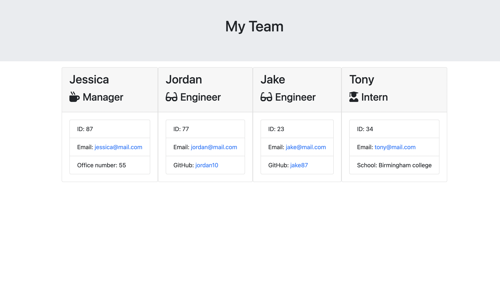

# Team Profile Generator

## Description

A command line application that can generate an HTML page which displays information about the people on a development team.

## Screenshot



## Installation

Open an empty folder and run the following commands.

```
git clone 
npm i
```

## Usage

Once installed, run the following command and answer the prompts.

```
node index
```

## License

MIT